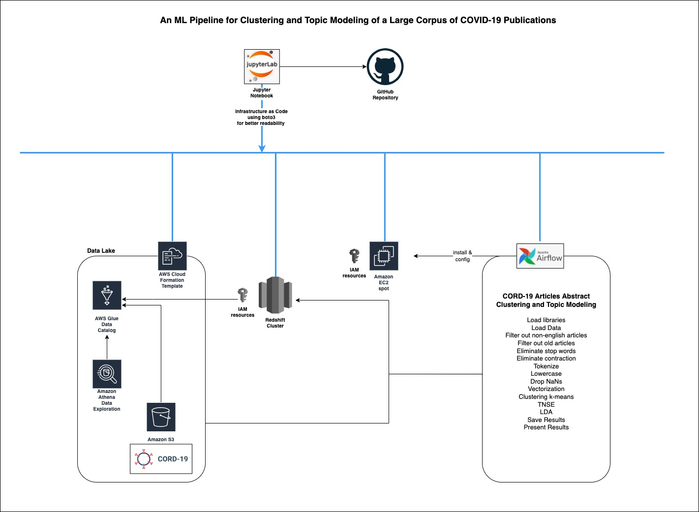

# cord19-processing
NLP on CORD19 dataset using AWS infrastructure and Airflow as orchestrator

## Objectives
-	Learning! 
-	Build a Machine Learning data pipeline for NLP processing 
-	The pipeline should be easy scalable for small and large data sets
-	The pipeline should allow for adding new processing steps and also new algorithms 
-	The pipeline should be 100% cloud based 
-	The pipeline should be deployable as code using Infrastructure-as-Code paradigm 

## Constraints
-	This project is an educational project deployed in AWS using my personal account (I need to keep balance between the number, volume of resources AND also cost)
-	The structure of the project needs to be easy to understand (for example Infrastructure as Code might be better served as a CloudFormation template or a CDK stack but I choose to use Jupyter notebooks and boto3 because it is easier to convey the steps)
-	Some of the resource’s deployment might seem redundant or unnecessary (for instance the Redshift cluster can be replaced by directly accessing the s3 data lake) but the goal is learning and adding a more complex infrastructure is a good way to achieve this 
-	Some of the resource’s configuration can be made much more scalable (for instance Airflow should be configured using maybe the MWAA service or with a MySQL and airflow kubernetes executor) but I needed to find the proper balance between time allocated, cost and the final goal. 
-	Further iterations on this project might ameliorate some of these issues.

## The code for this project
-	Infrastructure deployment – folder infrastructure-deployment 
-	Exploratory data analysis – folder exploratory-data-analysis
-	Evaluating ML algorithms – folder evaluating-ml-algorithms
-	Airflow DAGs code – folder airflow-dags-code 
-	Reports – folder reports
-	Data – folder data
-	Images – folder images

## The dataset (corpus)
The project uses CORD-19 The COVID-19 Open Research Dataset. CORD-19 is a growing resource of scientific papers on COVID-19 and related historical coronavirus research.    
A comprehensive description of the corpus can be found at CORD-19: [The COVID-19 Open Research Dataset](https://www.aclweb.org/anthology/2020.nlpcovid19-acl.1.pdf).     
AWS provides a [COVID-19 public data lake](https://aws.amazon.com/blogs/big-data/a-public-data-lake-for-analysis-of-covid-19-data/). This data lake contains CORD-19 comprehensive metadata.      
AWS provides an [S3 bucket](https://registry.opendata.aws/cord-19/) containing full-text and metadata dataset of COVID-19 and coronavirus-related research articles optimized for machine readability.     

#### Corpus Metadata
Given the corpus size (almost 200,000 publications as of June 2021) and also the weekly increments, metadata becomes highly important for data analysis and pre-processing as it offers a deep insight into this vast array of papers without the need to commit a large set of resources.     
The metadata can be easily accessible after being mounted to AWS Glue Data Catalog using a [CloudFormation template](https://covid19-lake.s3.us-east-2.amazonaws.com/cfn/CovidLakeStack.template.json) maintained by AWS. The process accessing the metadata in an AWS account is thoroughly [explained](https://aws.amazon.com/blogs/big-data/a-public-data-lake-for-analysis-of-covid-19-data/).     

#### Corpus Full Text
Amazon Resource Name (ARN): arn:aws:s3:::ai2-semanticscholar-cord-19     
AWS Region: us-west-2    
CLI Access:aws s3 ls s3://ai2-semanticscholar-cord-19/ --no-sign-request     

## Infrastructure   
The intention is to have all the piping done using the Infrastructure-as-Code paradigm using Python within Jupyer notebooks for easy readability.
The following diagram describe at high level the infrastructure deployed.  
    
