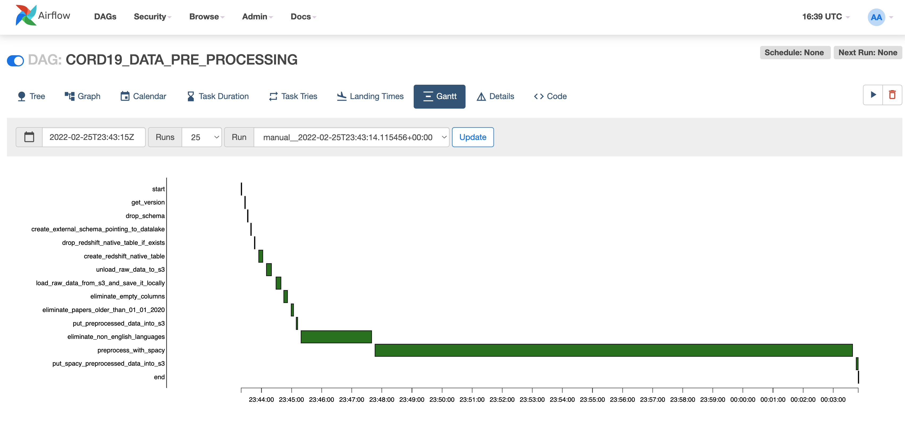
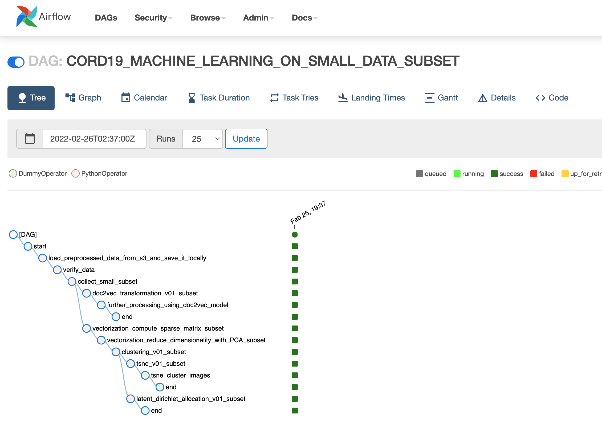
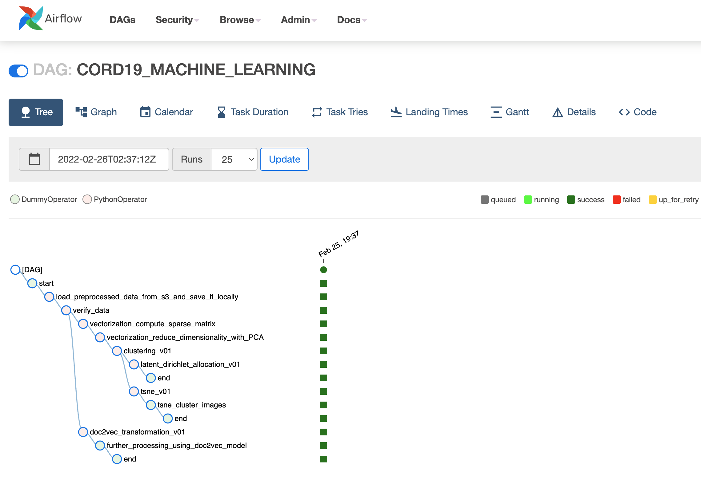

# Python Code for the Airflow dags
The content of this folder is loaded by the infrastructure-deployment.ipynb Jupyter notebook into the dags folder of the Airflow installation.
This folder contains the code for the dags and also all the functions associated with the python executors. 
The following dags are instantiated:
- data pre processing dag (cord19_processing_dag.py)
- a dag that processes a small set of the data for easier assessment (cord19_ml_small_subset_dag.py)
- a dag that processes the entire set of data (cord19_ml_dag.py)

The following files contain the code used by the python executors:
- cleanup_utils.py - utilities for text cleanup 
- language_utils.py - utilities for pre processing 
- ml_utils_vectorization.py - code for vectorization and clustering
- spacy_utils.py - code using spacy 
- transfer_utils.py - utilities for file transfer   

### Pre processing Airflow dag
 

### Small dataset processing Airflow dag
 

### Entire dataset processing Airflow dag
 

