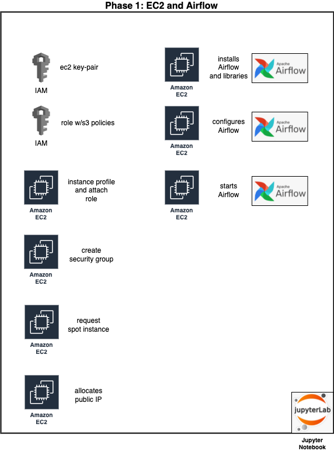

# Deployment Architecture
This document describes the deployment architecture and some related aspects like:
- design decision
- associated cost 
- pre deployment checklist

### Over all system architecture
The chosen deployment is an on demand Infrastructure as Code solution that would work for any AWS account in US East 2 region.
The solution will deploy all the resources needed for orchestration of:
- Airflow (the main orchestrator) installation and setup
- loading the data
- pre processing the data 
- model training (clustering and topic modeling)
- create a simple visualization
- cleanup all the resources     
 

### Motivation behind de design decisions 
The main motivator for this design was learning through exposure to different technologies:
- Infrastructure as Code - for easy readability I used Jupyter Notebook and boto3 - for an enterprise solution I would use CDK or CloudFormation templates 
- Airflow for orchestration – my implementation was a basic Airflow installation on a ec2 instance – for any enterprise I would pick a containerization approach (Airflow, executor and database)
- A data lake – used an AWS provided CloudFormation template for deploying the cor19 glue database
- Redshift as interface to the datalake – this is definitely an overkill but learning was the main motivator 

### Cost associated with deploying the architecture 
The Cost is direct proportional with the size of the resources and also the time the resources are used.
Considering the fact that the purpose of the system is strictly for learning and the cost pillar is paramount I made the following decisions:
- I used only the cord19 metadata and not the entire text of the publications – the metadata is hosted and offered free of charge by AWS (in us-east-2 region)
- By default, the solution uses an ec2 spot instance of size t3.xlarge with a maximum price of $0.12/hour. The solution might require 2-3 hours of running this instance size (ubuntu)
- Redshift – by default the solution uses one dc2.large node that currently is priced at $0.25/hour 
- S3 data storage for intermediate and final results store are negligible but attention needs to be allocated if the scope of the solution is changed
- There are other costs associated with the infrastructure (like needed elastic IP addresses) but if the resources are used only for 2-3 hours then the cost is small  

It is very important that at the end of the processing the resources to be de allocated.

### Pre-deployment checklist 
Jupyter Labs installed locally 
Python 3 (I used 3.8.2)
An AWS account 
Run the cord19 CloudFormation template to create the necessary Glue database

## Infrastructure Deployment
A Jupyter notebook that deploys the necessary resources for the ML pipeline.
In order to deploy the infrastructure the pre deployment requirements need to be met (see above).
Next step is to open the Jupyter notebook located in this current folder and follow all the instructions up until the resources de allocation.

### Phase 1 - EC2 and Airflow configuration 
    

### Phase 2 - Redshift and data lake setup 
     

### Phase 3 - Airflow and Redshift in place - dags ready to be triggered 
     

### Phase 4 - Trigger data pre processing  
     

### Phase 5 - Trigger data processing on a small data subset  
     

### Phase 6 - Trigger data processing on the entire data subset  
     

### Phase 7 - Resource de allocation 
     
