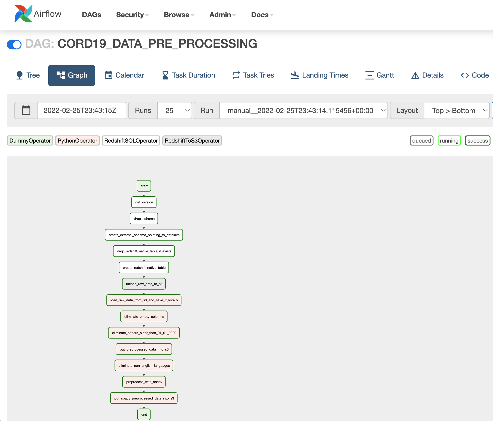

# Processing Workflow
This page provides some insight into the processing steps.  
Currently, there are three stages for processing:
- a data preparation and pre-processing phase
- a data processing pipeline using a small data set - this phase proves the viability of the pipeline and also gives some estimations regarding the time necessary to process the entire data set
- the ML pipeline per se - providing the run of the pipeline using the entire data set

### Data pre-processing   
The following graph (derived from Airflow) explains the  steps taken for pre-processing the corpus:   
    
