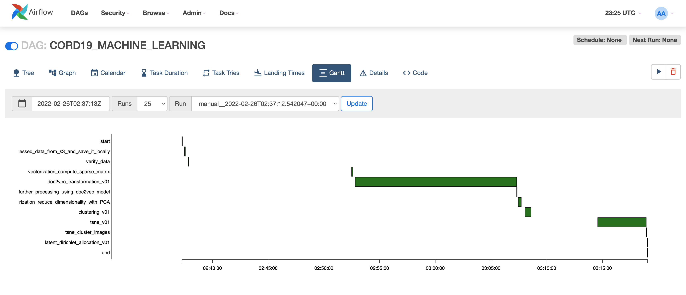

# Processing Workflow
This page provides some insight into the processing steps.  
The code for the dags and operators is in the following folder
[airflow-dags-code](https://github.com/dantohe/cord19-processing/tree/main/airflow-dags-code)      
Currently, there are three stages for processing (each phase with its own Airfloe DAG):
- a data preparation and pre-processing phase
- a data processing pipeline using a small data set - this phase proves the viability of the pipeline and also gives some estimations regarding the time necessary to process the entire data set
- the ML pipeline per se - providing the run of the pipeline using the entire data set

    

### Data pre-processing   
The following graph (derived from Airflow) explains the  steps taken for pre-processing the corpus:   
    

The following image presents the Airflow tree of this processing
    

The following image presents the the time it took for each task to finish the pre processing.
    

### Data processing using a small subset of papers 
The following graph (derived from Airflow) explains the  steps taken for processing a small subset of the corpus (around 1500 papers)
    

The following image presents the Airflow tree of this small set processing
    

The following image presents the the time it took for each task to finish this small set processing.
    

### Data processing using the entire set of papers 
The following graph (derived from Airflow) explains the  steps taken for processing the corpus
    

The following image presents the Airflow tree of processing
    

The following image presents the the time it took for each task to finish the processing.
    
